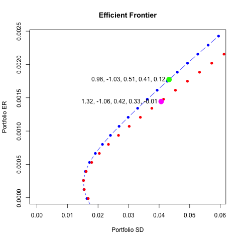

[](http://quantlet.de/)

## [](http://quantlet.de/) **RobustM_Example** [](http://quantlet.de/)

```yaml

Name of Quantlet:    'RobustM_Example'

Published in:        'Robustifying Markowitz'

Description:         'This Quantlet builds two efficient frontiers from 5 stocks to demonstrate sensitivity of weights to change of the mean estimator'

Keywords:            'efficient frontier, portfolio, Markowitz, global minimum variance, mean-variance'

Author:             Alla Petukhina

Data:                SP100.Rdata

```

