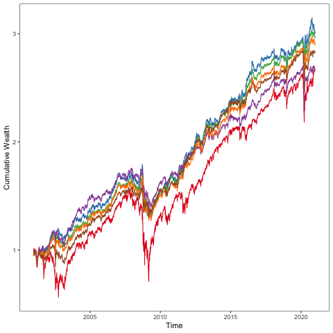
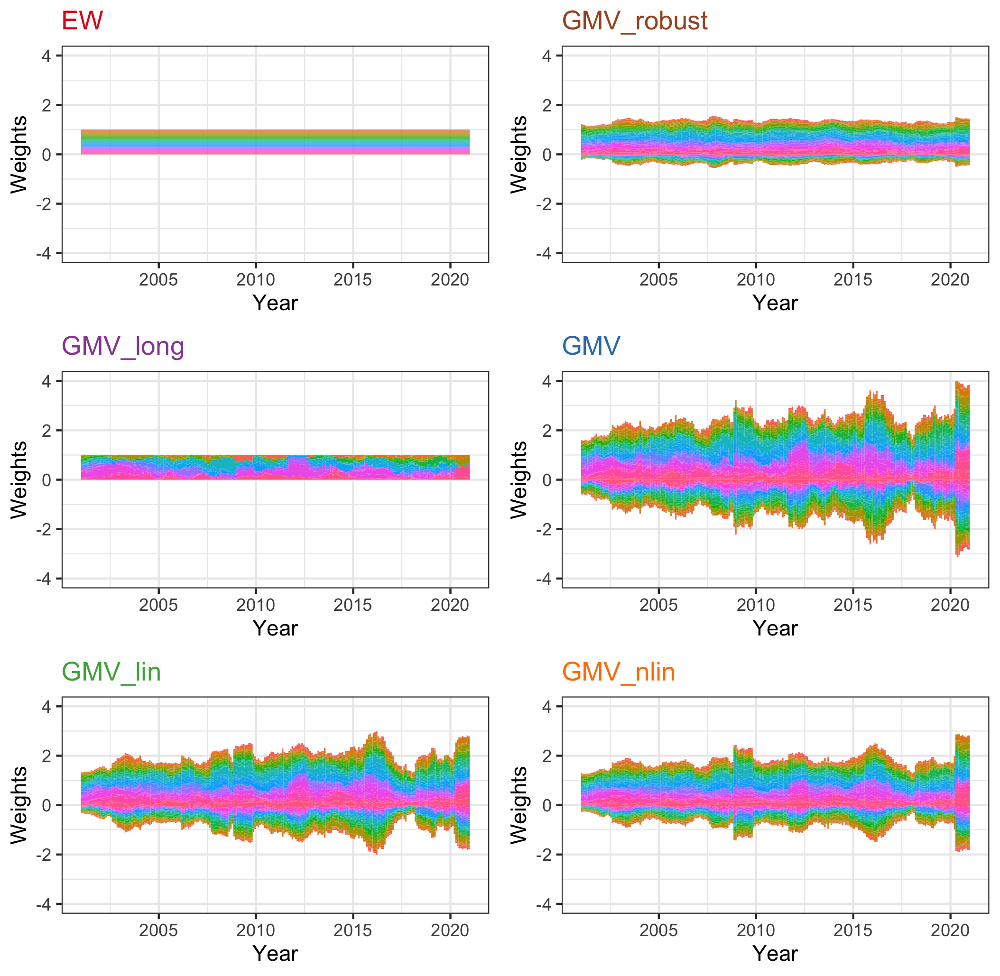

[](http://quantlet.de/)

## [](http://quantlet.de/) **RobustM_PerformanceRussellSP100** [](http://quantlet.de/)

```yaml

Name of Quantlet:    'RobustM_PerformanceRussellSP100'

Published in:        'Robustifying Markowitz'

Description:         'This Quantlet builds robust global minimum variance portfolio for 81 S&P100 constituents for the period 20000101-20201231. The robust procedure based on projected gradient descent technique with median-of-means estimator as described in the paper. The performance of portfolios is compared with benchmark portfolios'

Keywords:            'robust, gradient descent, portfolio, Markowitz, cumulative returns, global minimum variance, mean-variance, median of means'

Author:              Yegor Klochkov, Alla Petukhina

Dataset:             RussellSP100.Rdata

```



